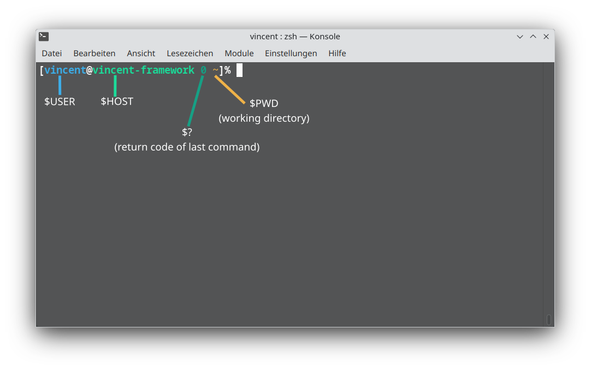
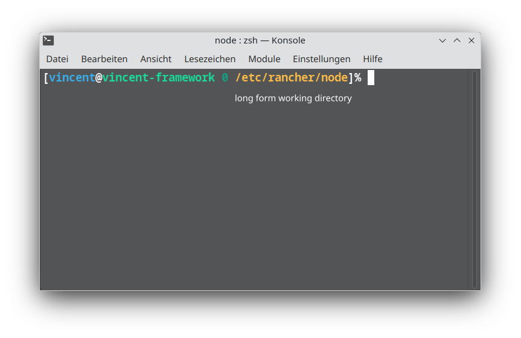
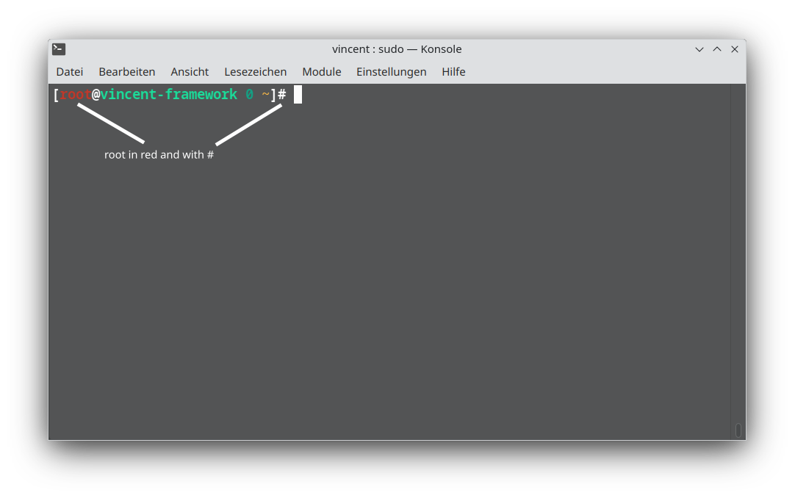
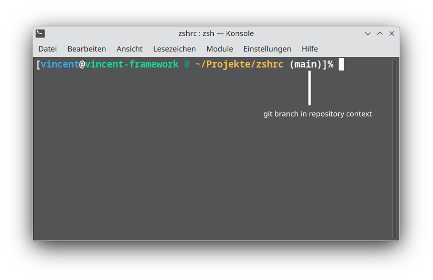
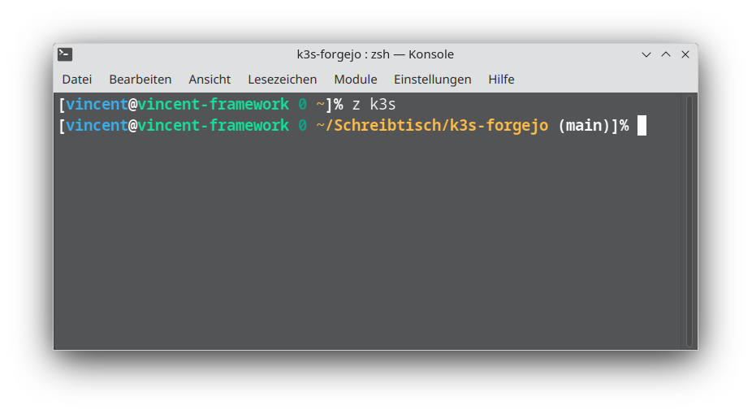

zsh setup
=========

This is my personal favorite zsh setup.
As a long time bash user I wanted to try out zsh and what cool features it has to offer while still feeling comfortable with what I was used from bash.
While fancy setup with oh-my-zsh do exist I wanted to experience the advantages in a more conservative way I am accustomed to. So I configured it to behave my favorite commodities with some extras.

$PS1 (prompt)
------------

The prompt looks very similar to bash "\$PS1" with some minor differences. A normal user prompt is suffixed with % like it is default in zsh instead of bash $. root prompt is still suffixed with #.
The hostname is green, normal user is blue, root user is red, working directory yellow. Working directory is usually displayed in full.

I incorporated the return code ($?) of the lastly executed command in the prompt in teal. A succesful command usually returns 0.

Git branch has also been incorporated. It is only visible in valid git repositories.

Other features.
--------------

Typing "history" returns the full history like in bash. This is accomplished by aliasing "history" to "history 1". CTRL+R initiates backward history search like in bash. With ALT+CursorKeys or CTRL+CursorKeys you can navigate word by word through your buffer. CTRL+W kills a word, "cd -" hops to last directory, ALT+. returns last argument from previous command, CTRL+X,E loads buffer into nvim and so on...
Tab completion uses the zsh style selector you can navigate also with your arrow keys.

This setup assumes neovim is your favorite editor and sets it as default. Aliases for vi and vim are set. Install neovim or adjust config accordingly.

History size has been extended to 10000 entries.

Aliases ll and lt and coloring for ls

Setup
--------------

Simply copy zshrc to ~/.zshrc for your user.

Enable zsh-z
--------------

zsh-z enables the "z" command.
For example typing "z k3s" navigates to the most likely folder you wanted to navigate to containing k3s in its name.

To enable uncomment "source /home/$USER/zsh-z/zsh-z.plugin.zsh" and clone https://github.com/agkozak/zsh-z accordingly. For root execute "mkdir -p /home/root" and put there accordigly
